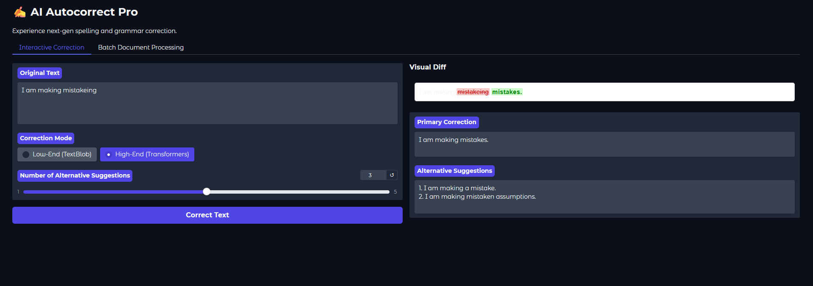
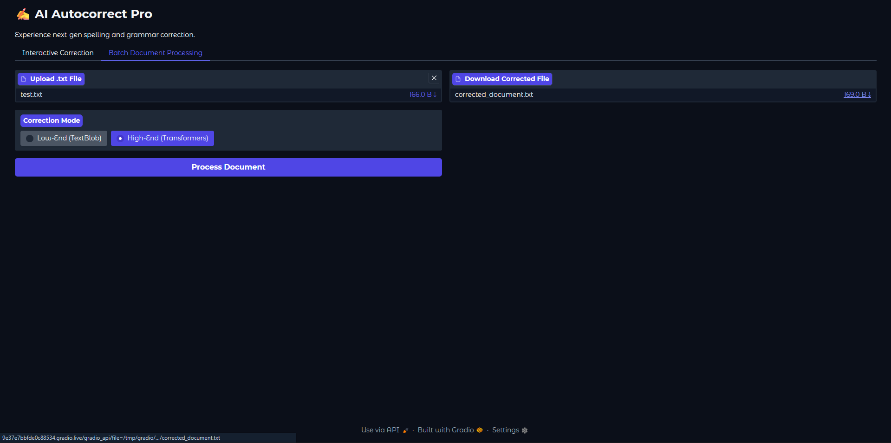

# AI Autocorrect Tool

An AI-powered autocorrect and grammar correction tool supporting two distinct modes of operation: a lightweight offline mode for quick spelling fixes, and a robust Transformer-based mode for context-aware grammar correction.

## Features

- **Low-End Mode (TextBlob):** Fast, offline spell checking based on word frequency. Ideal for quick, single-word typos without context.
- **High-End Mode (Transformers):** Uses a pre-trained T5 sequence-to-sequence model to perform context-aware grammar and spelling correction (e.g., distinguishing between "I like your short" vs "I like your shirt").
- **Web Interface (Gradio):** A sleek, modern web UI to test and compare both models side-by-side.
- **Command Line Interface:** Simple CLI to process text directly from your terminal.

## Screenshots

### Interactive Correction
Visual diff highlighting allows you to see exactly which words were removed and added.


### Batch Document Processing
Upload a text document and have the AI correct it line-by-line automatically.


## Installation

1. Clone this repository.
2. Ensure you have Python 3.8+ installed.
3. Install the dependencies:

```bash
pip install -r requirements.txt
```

> **Note:** The High-End mode will automatically download the required HuggingFace model (~850MB) on its first run.

## Usage

### 1. Web Interface (Recommended)
Launch the Gradio web application:
```bash
python app.py
```
This will open a local web server (typically `http://127.0.0.1:7860`) where you can interactively test the models.

### 2. Command Line Interface
Run the CLI in either `low` or `high` mode:
```bash
# Start an interactive session in high-end mode
python main.py --mode high

# Or correct a specific sentence directly
python main.py --mode high --text "He is go to the store."
```

### 3. Kaggle / Colab
This tool is highly optimized to run on cloud platforms with GPUs. Simply copy the logic from `autocorrect.py` into a notebook cell, and ensure the hardware accelerator (GPU) is enabled for massive speedups.
